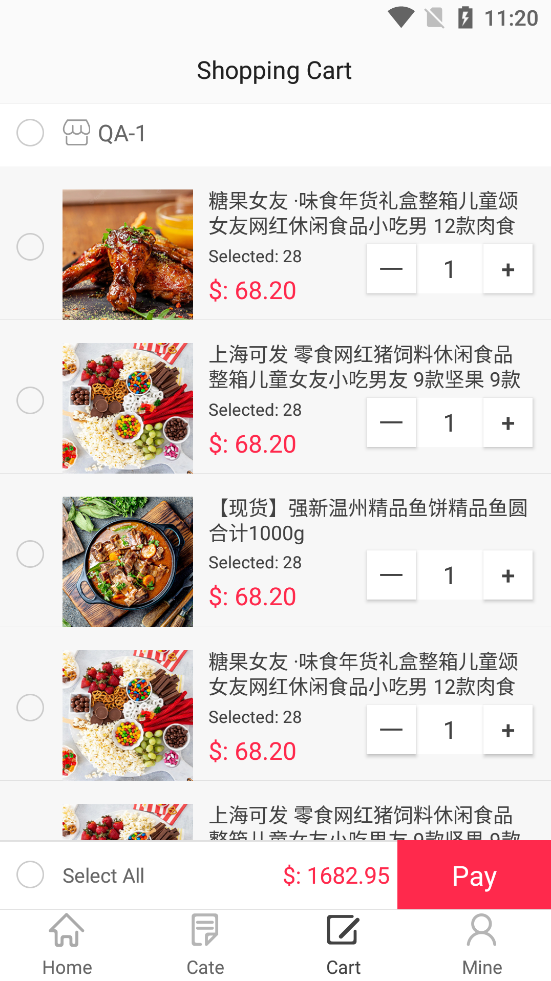

### Android Application Assignment 2022-05 (ICS4U0-B Ms. Wilson)

The Github repository for my ICS4U Android application assignment.

### Demonstration of the application

+ **Homepage**
  
  

+ **Category**
  
  

+ **Shopping Cart**
  
  

+ **Personal Page**
  
  

### Thanks for the following projects

+ [CcMall by CuiChenbo](https://github.com/CuiChenbo/CcMall)

+ [NineGridView by jeasonlzy](https://github.com/jeasonlzy/NineGridView)
